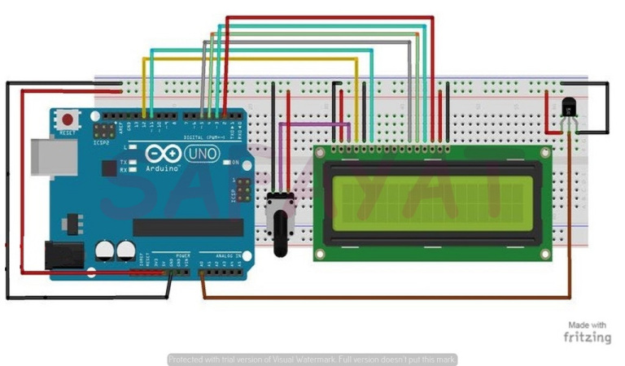

# digital thermometer
# Introduction :
Thermometers are useful apparatus being used since long time for temperature measurement. A real time Digital Thermometer can be deployed in houses, offices, industries etc. to display the current ambient temperature and temperature changes.
# LM35 Temperature Sensor : 
LM35 is a 3 pin temperature sensor which gives 1 degree Celsius on every 10mVolt change. This sensor can sense up to 150 degree Celsius temperature.
# Apparatus : 
* Arduino Uno
* Breadboard
* LM35 Sensor
* 16*2 LCD display
* Potentiometer – Rotary and
* Jumper Wires
# Schematics : 

# Code : 
[Code Link](Digital_Thermometer.ino)

 
